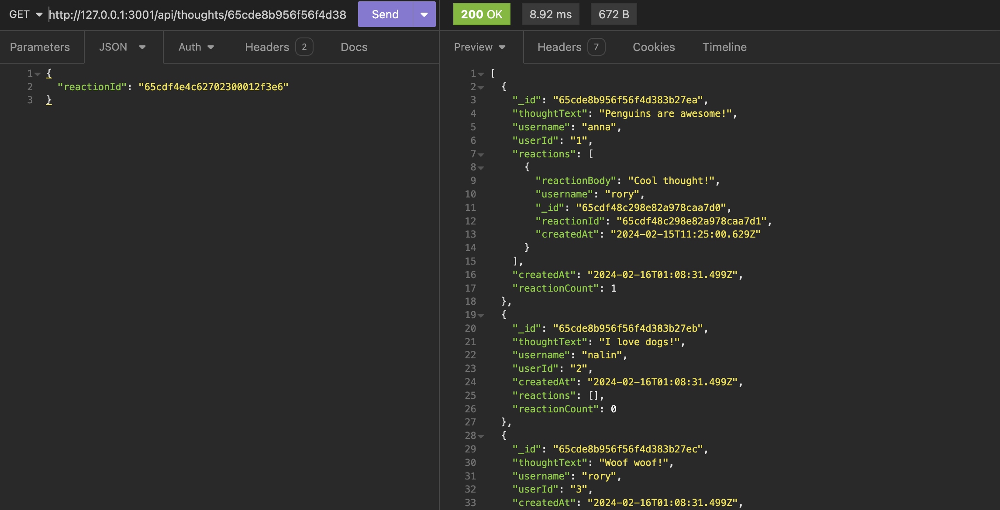

# social_network_api

## Description

An API for a social network web application where users can share their thoughts, react to friends’ thoughts, and create a friend list. This program uses Express.js for routing, a MongoDB database, and the Mongoose ODM.

Through this project I learned how to use Mongoose and MongoDB as well as API routing.

### User Story

AS A social media startup
I WANT an API for my social network that uses a NoSQL database
SO THAT my website can handle large amounts of unstructured data

### Acceptance Criteria

GIVEN a social network API:
- WHEN I enter the command to invoke the application
- THEN my server is started and the Mongoose models are synced to the MongoDB database
- WHEN I open API GET routes in Insomnia for users and thoughts
- THEN the data for each of these routes is displayed in a formatted JSON
- WHEN I test API POST, PUT, and DELETE routes in Insomnia
- THEN I am able to successfully create, update, and delete users and thoughts in my database
- WHEN I test API POST and DELETE routes in Insomnia
- THEN I am able to successfully create and delete reactions to thoughts and add and remove friends to a user’s friend list

## Table of Contents

- [Installation](#installation)
- [Usage](#usage)
- [Credits](#credits)
- [License](#license)

## Installation

1. Download project files to your local machine
2. Open integrated terminal in the root file
3. In the terminal, run `npm i` to install required dependencies and devDependencies
4. Run `npm run seed` command to seed the database
5. Run `npm start` command to start server
6. Open insomnia and make a get request at `http://127.0.0.1:3001/api/users` and `http://127.0.0.1:3001/api/thoughts` For this route you can make Get, Get by user/thought _id, Post, Put and Delete requests.
7. Use `http://127.0.0.1:3001/api/users/:userId/friends` route for Post and Delete requests to create and delete friend connections
8. Use `http://127.0.0.1:3001/api/thoughts/:thoughtId/reactions` route for Post and Delete requests to create and delete tought reactions

## Usage

This is a back-end project that can be used when you download the files and use a program like insomnia to make API calls.

Repo URL: [https://github.com/ahgeak/social_network_api](https://github.com/ahgeak/social_network_api)

Video of Program Walkthrough: [Linked Video]()

Here is a screenshot of a get request to get thoughts and reactions:

## Credits

I created this program from scratch applying concepts I learned in class.

## License

This project uses an MIT License.